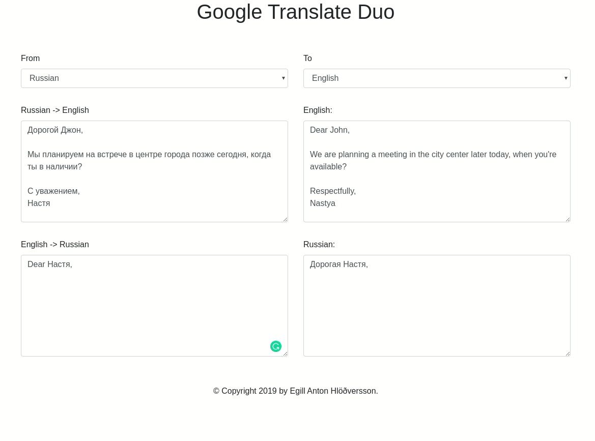

## Table of Contents
<!-- ⛔️ MD-MAGIC-EXAMPLE:START (TOC:collapse=true&collapseText=Click to expand) -->
<details>
<summary>Click to expand</summary>

1. [Introduction](#1-introduction)
2. [Setup](#2-setup)
3. [Authors](#3-authors)
4. [License](#4-license)
5. [References](#5-references)

</details>
<!-- ⛔️ MD-MAGIC-EXAMPLE:END -->

## 1 Introduction
Google Translate Duo a translation tool that runs on top of a Flask Web Server. 
It uses Google Translation services for its functionality.
The main advantage of Google Translate Duo is the capability of typing text with the previous translation visible at all times. 

No API Key Required, so it is entirely free.


## 2 Setup

Make sure to have Python 3.6 or newer installed.

### 2.1 Get virtualenv

```bash
$ pip3 install virtualenv
```

### 2.2 Create a virtual enviroment

Make sure to create a Python3 instead of Python2 environment by referencing its binaries.
```bash
$ which python3
/usr/bin/python3
```

You can use any name you want, we will use "venv".
```bash
$ virtualenv -p /usr/bin/python3  venv
```

### 2.3 Activate enviroment

```bash
$ . venv/bin/activate
```

Now you have activated your virtual environment, and your terminal should display its name as so:
```bash
$(venv)
```

### 2.4 Install requried packages
```bash
$(venv) pip install -r requirements.txt  
```

### 2.5 Run The Application

```bash
$(venv) python server.py
```

You’ll see output similar to this:

```bash
Serving Flask app "server"
Environment: development
Debug mode: on
Running on http://127.0.0.1:5000/ (Press CTRL+C to quit)
```


## 3 Authors
* [Egill Anton Hlöðversson](https://github.com/egillanton)

## 4 License
This project is licensed under the Apache License, Version 2.0 - see the [LICENSE](LICENSE) file for details.

## 5 References
* [Google Translate](https://translate.google.com/)
* [Googletrans - Free Google Translate API for Python](https://github.com/ssut/py-googletrans)

<p align="center">
🌟 PLEASE STAR THIS REPO IF YOU FOUND SOMETHING INTERESTING 🌟
</p>